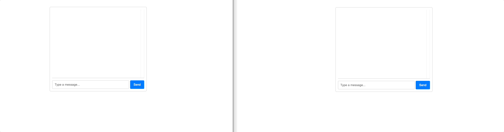

# Простой чат (без учета пользователей)

<p align="center">
    
<p>

## Server

```js
//  /server/app.js
const server = http.createServer(app);
const wss = new WebSocket.Server({ server });

wss.on("connection", (ws) => {
  console.log("New client connected");

  ws.on("message", (message) => {
    wss.clients.forEach((client) => {
      if (client.readyState === WebSocket.OPEN && client !== ws) {
        client.send(message.toString());
      }
    });
  });
});

server.listen(3000, () => {
  console.log("Server is running on port 3000");
});


```

## Client

```jsx
// client/src/components/Chat/Chat.jsx
import React, { useState, useEffect } from "react";
import "./Chat.css";
const Chat = () => {
  const [messages, setMessages] = useState([]);
  const [input, setInput] = useState("");
  const [ws, setWs] = useState(null);

  useEffect(() => {
    const socket = new WebSocket("ws://localhost:3000");

    socket.onmessage = (event) => {
      const message = JSON.parse(event.data);
      if (message.type === "CHAT_MESSAGE") {
        setMessages((prevMessages) => [...prevMessages, message.data]);
      }
    };

    setWs(socket);

    return () => {
      socket.close();
    };
  }, []);

  const handleSubmit = (event) => {
    event.preventDefault();

    if (input.trim() !== "" && ws && ws.readyState === WebSocket.OPEN) {
      ws.send(JSON.stringify({ type: "CHAT_MESSAGE", data: input }));
      setMessages((prevMessages) => [...prevMessages, input]);
      setInput("");
    }
  };

  return (
    <div className="chat-container">
      <div className="messages">
        {messages.map((message, index) => (
          <div key={index} className="message">
            {message}
          </div>
        ))}
      </div>
      <form onSubmit={handleSubmit} className="chat-form">
        <input
          type="text"
          value={input}
          onChange={(e) => setInput(e.target.value)}
          placeholder="Type a message..."
          className="chat-input"
        />
        <button type="submit" className="chat-button">
          Send
        </button>
      </form>
    </div>
  );
};

export default Chat;

```