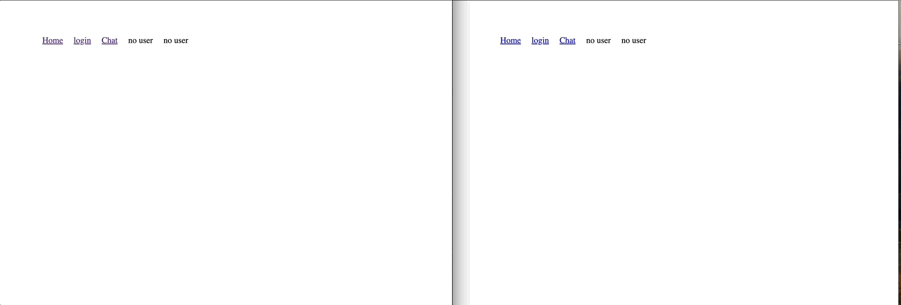

# Общий чат со всеми пользователями

<p align="center">
    
<p>

Функции:
- добавление сообщений
- удаление своих сообщений
- изменение своих сообщений (в течении 5 минут)
- рассылка новых сообщений все пользователям
- верификация пользователя на сервере с помощью refreshToken в cookie

## Server
 
```js
// /server/app.js
const express = require("express");
const http = require("http");
const apiRouter = require("./routes/api/api.routes");
const serverConfig = require("./config/serverConfig");
const { connectionCb, wss } = require("./socket/wsServer");

const app = express();

serverConfig(app);

app.use("/api", apiRouter);

const wssCb = require("./socket/wssCb");
const server = http.createServer(app);

// Ловим событие переключения на сокеты
server.on("upgrade", connectionCb);
// Ловим событие подключения к веб-сокету см connectionCb  wss.emit("connection", ws, request, user.user);
wss.on("connection", wssCb);

server.listen(3000, () => {
  console.log("Server is running on port 3000");
});

```
### connectionCb, wss  ->  /server/socket/wsServer.js

При подключении пользователя парсим cookie, верифицируем token и достаем пользователя.
Если пользователь есть, то обновляем наше соединение с http на socket.

Отдаем (экспортируем) socket соединение `wss` и `connectionCb` - функцию которая отвечает за апгрейд соединения.


```js
// server/socket/wsServer.js
const cookieParser = require("cookie-parser");
const jwt = require("jsonwebtoken");
require("dotenv").config();
const { WebSocketServer } = require("ws");
const wss = new WebSocketServer({ clientTracking: false, noServer: true });

const connectionCb = (request, socket, head) => {
  console.log("Parsing session from request...");
  // Используем cookieParser для парсинга кук из запроса
  cookieParser()(request, {}, () => {
    const token = request.cookies.refreshToken;

    try {
      // достаем из кук токен и проверяем его
      const user = jwt.verify(token, process.env.REFRESH_TOKEN_SECRET);
      console.log("Session is parsed!");

      // Если все ок, то подключаемся к веб-сокету
      // request - это объект запроса, socket - это сокет, head - это заголовок
      // ws - это объект веб-сокета
      wss.handleUpgrade(request, socket, head, function (ws) {
        // Подключаемся к веб-сокету и передаем в него пользователя из кук
        wss.emit("connection", ws, request, user.user);
      });
    } catch (error) {
      socket.write("HTTP/1.1 401 Unauthorized\r\n\r\n");
      socket.destroy();
      return;
    }
  });
};

module.exports = { connectionCb, wss };

```
### broadcast (метод для рассылки сообщения всем пользователям)
```js
// /server/socket/broadcastMessage.js
/**
 * Отправляет сообщение всем клиентам
 * @param {*} clients - socket clients
 * @param {*} message  - сообщение
 */
const broadcast = (clients, message) => {
  clients.forEach((client) => {
    if (client.readyState === WebSocket.OPEN) {
      client.send(JSON.stringify(message));
    }
  });
};

module.exports = { broadcast };

```

### wssCb ->  server/socket/wssCb.js

В этом файле основная логика приложения, если ранее соединение было успешно установлено.

Ловим событие прихода сообщения от клиента ` ws.on("message", async function (message) {})`.

Подразумевается,  что сообщение ,будут  объектом с типом события `type`  и данными `payload`

Далее в зависимости от события выполняем операцию на сущностью и используем функцию `broadcast` для рассылки новых данных все socket - клиентам
```js
// server/socket/wssCb.js
const clients = new Map();
const { broadcast } = require("./broadcastMessage");
const ChatService = require("../service/ChatService");

const wssCb = async (ws, request, user) => {
  //Добавляем пользователя в мапу
  clients.set(user.id, ws);

  ws.on("error", console.error);

  //Получаем сообщение от клиента
  ws.on("message", async function (message) {
    const { type, payload } = JSON.parse(message); /// пример message =  {type: "action_type", payload: { body: "Hello" }}

    //В зависимости от типа (type) сообщения выполняем разные действия
    // оборачиваем в try catch чтобы отлавливать ошибки
    try {
      switch (type) {
        case "NEW_MESSAGE":
          const message = await ChatService.addMessageToChat({
            userId: user.id,
            message: payload,
          });
          broadcast(clients, { type: "NEW_MESSAGE", payload: message });
          break;
        case "UPDATE_MESSAGE":
          const messageToUpdate = await ChatService.updateMessageInChat(
            payload.id,
            { message: payload.message }
          );
          broadcast(clients, {
            type: "UPDATE_MESSAGE",
            payload: messageToUpdate,
          });
          break;
        case "DELETE_MESSAGE":
          const deletedID = await ChatService.deleteMessageFromChat(payload);
          broadcast(clients, { type: "DELETE_MESSAGE", payload: deletedID });
          break;
        default:
          break;
      }
    } catch (error) {
      ws.send(
        JSON.stringify({
          type: "ERROR",
          payload: error.message,
        })
      );
    }
  });

  ws.on("close", function () {
    clients.delete(user.id);
  });
};

module.exports = wssCb;

```
## Client
 

```js
import React, { useContext, useEffect, useRef, useState } from "react";
import axiosInstance from "./../axiosInstance";
import { UserContext } from "../context/UserContext";

function ChatApp() {
  const [messages, setMessages] = useState([]);
  const [inputMessage, setInputMessage] = useState("");
  const { user } = useContext(UserContext);

  const ws = useRef(null);

  useEffect(() => {
    axiosInstance.get("/chat/messages").then(({ data }) => setMessages(data));
  }, []);

  useEffect(() => {
    ws.current = new WebSocket(`ws://localhost:3000`);

    ws.current.onopen = () => {
      console.log("Connected to WebSocket");
    };

    ws.current.onmessage = (event) => {
      const { type, payload } = JSON.parse(event.data);
      switch (type) {
        case "ERROR":
          alert(payload);
          break;
        case "NEW_MESSAGE":
          setMessages((prevMessages) => [...prevMessages, payload]);
          break;
        case "UPDATE_MESSAGE":
          console.log(payload);

          setMessages((prevMessages) =>
            prevMessages.map((msg) => (msg.id === payload.id ? payload : msg))
          );
          break;
        case "DELETE_MESSAGE":
          setMessages((prevMessages) =>
            prevMessages.filter((msg) => msg.id !== payload)
          );
          break;
        default:
          break;
      }
    };

    ws.current.onclose = () => {
      console.log("Disconnected from WebSocket");
    };

    return () => {
      ws.current.close();
    };
  }, []);

  const sendMessage = () => {
    if (inputMessage.trim() !== "") {
      ws.current.send(
        JSON.stringify({ type: "NEW_MESSAGE", payload: inputMessage })
      );
      setInputMessage("");
    }
  };

  const updateMessage = (id) => {
    const newText = prompt("Edit your message:");
    if (newText) {
      ws.current.send(
        JSON.stringify({
          type: "UPDATE_MESSAGE",
          payload: { id, message: newText },
        })
      );
    }
  };

  const deleteMessage = (id) => {
    ws.current.send(JSON.stringify({ type: "DELETE_MESSAGE", payload: id }));
  };

  return (
    <div>
      <div>
        <h2>Chat</h2>
        <ul>
          {messages.map((message) => {
            // Обновить можно только в течение 5 минут после отправки
            const messageTimestamp = new Date(message.createdAt);
            const now = new Date();
            const timeDiff = now - messageTimestamp;
            const canEdit = timeDiff <= 5 * 60 * 1000;
            return (
              <li key={message.id}>
                <small>Sent by: {message.User.email} </small>
                {message.message}
                {canEdit && message.userId === user?.id && (
                  <button onClick={() => updateMessage(message.id)}>
                    Edit
                  </button>
                )}
                {message.userId === user?.id && (
                  <button onClick={() => deleteMessage(message.id)}>
                    Delete
                  </button>
                )}
              </li>
            );
          })}
        </ul>
      </div>
      <input
        type="text"
        value={inputMessage}
        onChange={(e) => setInputMessage(e.target.value)}
      />
      <button onClick={sendMessage}>Send</button>
    </div>
  );
}

export default ChatApp;

```